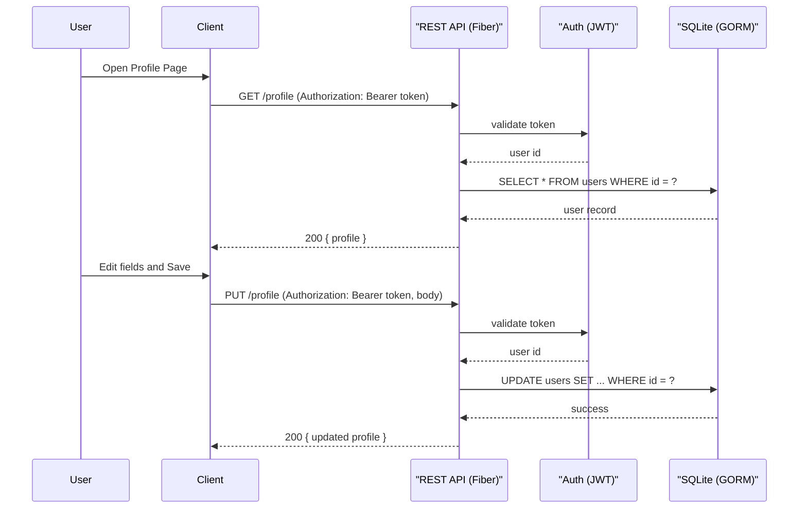
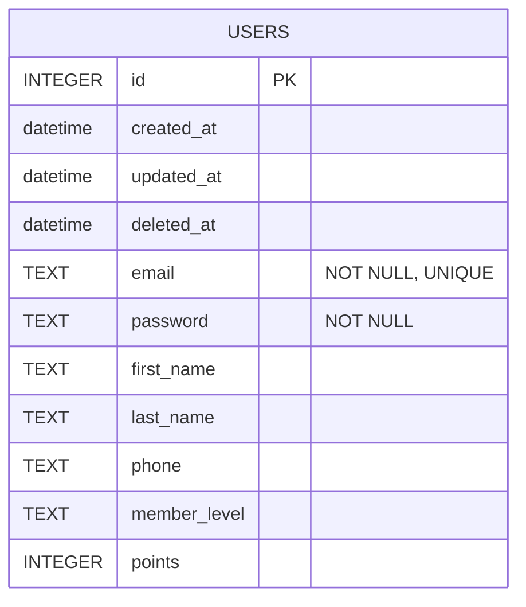

# System Design

This file contains diagrams in Mermaid format: sequence diagram for user profile update flow and ER diagram for the database schema.

## Sequence Diagram: Update Profile

## ER Diagram

